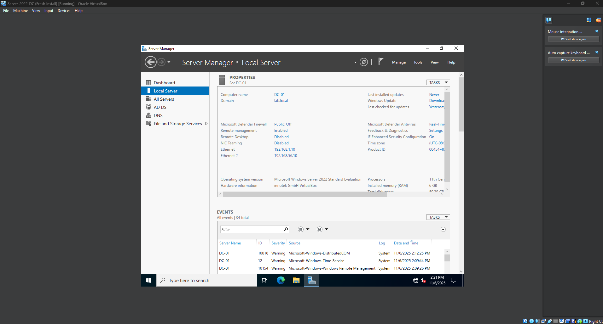
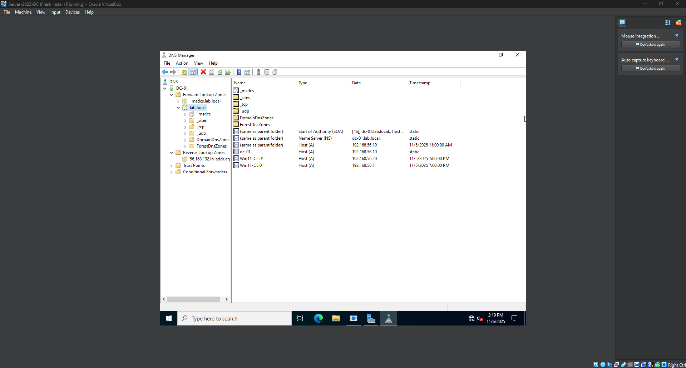
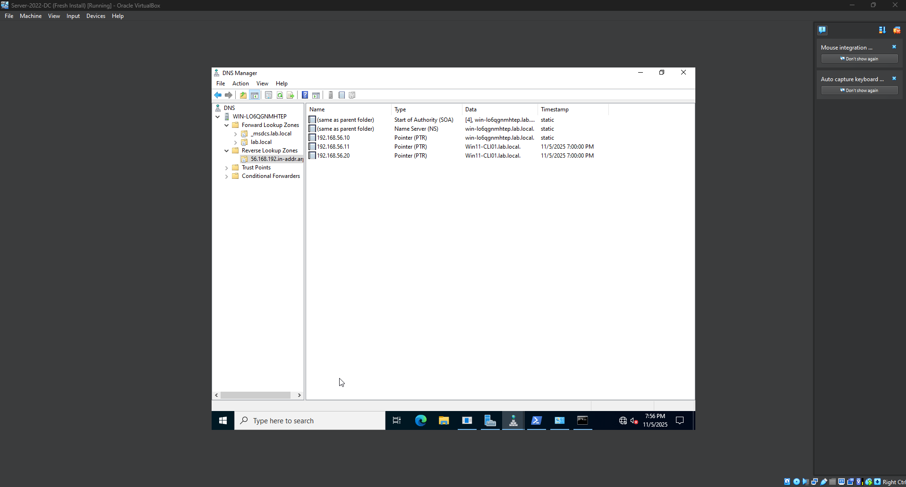

# Lab 2 – Domain Controller + DNS Configuration

**Goal:**  
Promote the Windows Server to a Domain Controller and configure DNS so the domain can perform **identity and resource resolution** required for authentication and Group Policy.

---

## What I Did

1. Installed the **Active Directory Domain Services (AD DS)** role.
2. Installed the **DNS Server** role (DNS is a required dependency for Active Directory).
3. Promoted the server to a Domain Controller and created the new domain: `lab.local`.
4. Rebooted and logged in using the domain administrator account: `LAB\Administrator`.

DNS is installed and configured automatically during domain promotion because Active Directory relies on DNS to locate domain services.

---

## Why This Matters

Active Directory relies on **DNS** to locate domain resources.  
If DNS is misconfigured, clients will fail to:

- Join the domain
- Authenticate with the domain controller
- Apply Group Policy reliably

To support identity resolution, two DNS zones were configured:

| Zone Type | Purpose | Example |
|----------|---------|---------|
| **Forward Lookup Zone** | Resolves hostname → IP address | `dc01.lab.local → 192.168.56.10` |
| **Reverse Lookup Zone** | Resolves IP address → hostname | `192.168.56.10 → dc01.lab.local` |

**Forward = “Who is this hostname?”**  
**Reverse = “Who owns this IP?”**

The **Reverse Lookup Zone** additionally supports:
- Kerberos ticket validation
- Monitoring & remote lookup tools (`nslookup`, event logs)
- Accurate system identification in logs & security auditing

---

## Verification

- `lab.local` appears in **Active Directory Users and Computers**
- **Forward Lookup Zone** contains A records for domain hosts
- **Reverse Lookup Zone** contains PTR records confirming IP → hostname mapping

---

## Screenshots

**01-Server-Manager-Domain-Confirmed.png**  
This screenshot shows the server with the **AD DS** and **DNS roles** installed, and confirms the machine is joined to the **lab.local** domain.

---

**02-DNS-Forward-Lookup-Zone-lab-local.png**  
This screenshot shows the **Forward Lookup Zone**, demonstrating **hostname → IP** resolution for devices inside the domain.

---

**03-DNS-Reverse-Lookup-Zone-PTR-Records.png**  
This screenshot shows the **Reverse Lookup Zone**, confirming **IP → hostname** resolution using **PTR records**, which supports authentication and accurate logging.

---

## Skills Learned

- Relationship between **AD DS** and **DNS**
- Configuring Forward and Reverse Lookup Zones
- Reading and validating **A** and **PTR** records
- Using Server Manager and DNS Manager for domain administration
