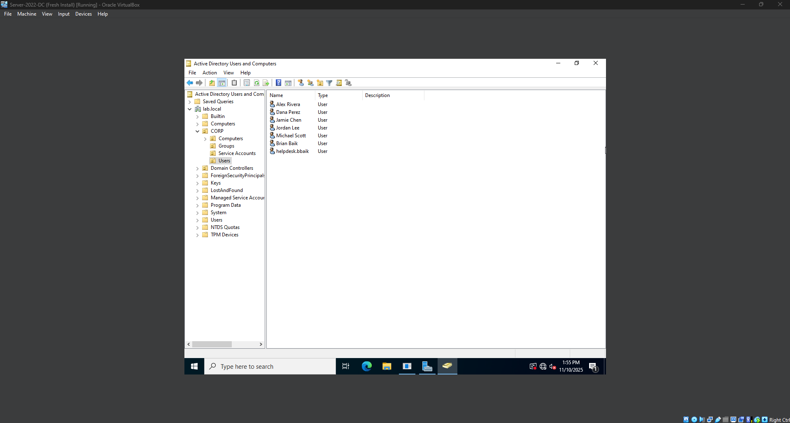
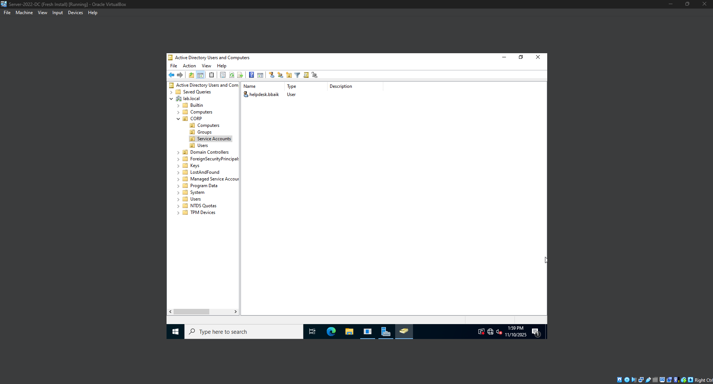
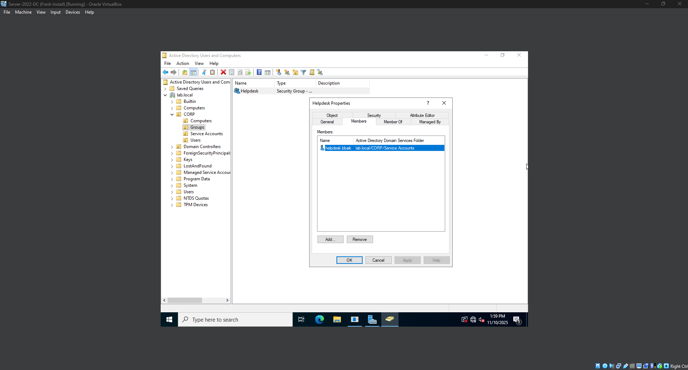

# Lab 4: Domain Users and Helpdesk Role Account

Goal:  
Create standard user accounts and a dedicated Helpdesk administrative account using consistent naming conventions and proper OU placement. This reflects real-world identity lifecycle and privilege separation practices.

---

## Why This Matters

Organizations do not use the built-in Administrator account for daily work.  
Instead, they separate identities into two categories.

| Account Type | Purpose | Example |
|-------------|---------|---------|
| Standard User Account | Daily login, workstation access, regular work | `bbaik` |
| Helpdesk or Administrative Account | Elevated permissions for support and administrative tasks | `helpdesk.bbaik` |

Separating regular identity and administrative identity reduces the risk of accidental privileged actions and limits impact in case of credential compromise. This is a widely used security standard in enterprise environments.

---

## Naming Convention

All users follow the first initial plus last name pattern.

| Display Name | Username (sAMAccountName) | UPN | OU Placement |
|--------------|---------------------------|------|--------------|
| Alex Rivera | `arivera` | `arivera@lab.local` | `CORP/Users` |
| Dana Perez | `dperez` | `dperez@lab.local` | `CORP/Users` |
| Jamie Chen | `jchen` | `jchen@lab.local` | `CORP/Users` |
| Jordan Lee | `jlee` | `jlee@lab.local` | `CORP/Users` |
| Michael Scott | `mscott` | `mscott@lab.local` | `CORP/Users` |
| Brian Baik (Standard Account) | `bbaik` | `bbaik@lab.local` | `CORP/Users` |
| Brian Baik (Helpdesk Account) | `helpdesk.bbaik` | `helpdesk.bbaik@lab.local` | `CORP/Service Accounts` |

The Helpdesk account is the only account with elevated rights.  
It was added to the Helpdesk security group located in: CORP/Groups/Helpdesk

---

## Directory Structure (Updated)

lab.local
CORP
Users
Computers
Groups
Helpdesk
Service Accounts
helpdesk.bbaik

---

## Skills Demonstrated

- Identity lifecycle management and account provisioning
- Separation of standard and administrative identity
- Consistent username and UPN formatting
- Accurate placement of objects in Organizational Units
- Group-based role assignment and security modeling

---

## Screenshots

  
Shows standard user accounts in CORP/Users.

  
Shows helpdesk.bbaik located in CORP/Service Accounts.

  
Shows helpdesk.bbaik as a member of the Helpdesk group.

Screenshots are stored in the `screenshots` directory.

---

## Verification

The Helpdesk account was confirmed to be the only account with elevated permissions by checking membership of the Helpdesk security group.

Standard user accounts do not have administrative rights and will be used later for workstation login and permission testing.

This establishes a clear separation between regular identity and administrative identity. This separation is a common requirement in managed IT environments.

---

## Next Lab

**Lab 5: File Share and NTFS Permissions**

This will use the Helpdesk group to grant access to specific shared folders.  
Standard user accounts will be used to verify that access is restricted based on group membership.
