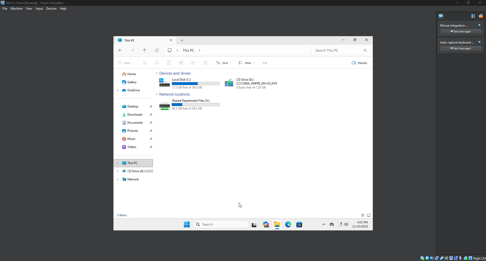
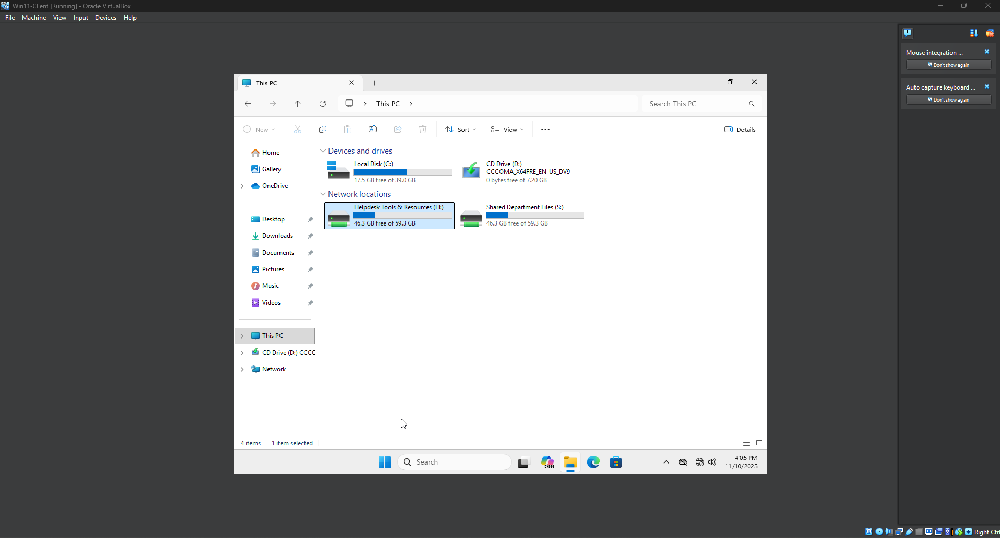
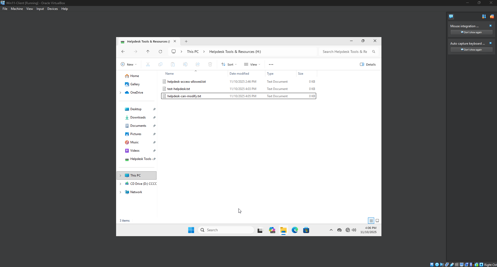

# Lab 6 – Group Policy Drive Mapping (GPO)

**Goal**  
Automatically map shared network drives for users based on group membership.  
This demonstrates how IT controls access and standardizes workstation setups without manual configuration.

---

## Environment

- **Domain:** `lab.local`
- **Domain Controller:** `DC-01` (Windows Server 2022)
- **Client:** Windows 11 (domain-joined)
- **Accounts Used for Testing:**
  - `LAB\bbaik` (standard user)
  - `LAB\helpdesk.bbaik` (member of **Helpdesk** security group)

---

## OU Structure
```
lab.local
└─ CORP
├─ Users
├─ Computers
├─ Groups
└─ Service Accounts
```

- `helpdesk.bbaik` is stored in **Service Accounts**
- The **Helpdesk** security group is stored in **Groups**

---

## What This GPO Does

| Drive Letter | Share Path              | Who Gets It                | Purpose                                   |
|-------------|-------------------------|----------------------------|-------------------------------------------|
| **S:**      | `\\DC-01\Shared`        | All domain users           | General shared department files           |
| **H:**      | `\\DC-01\Helpdesk`      | **Helpdesk** group members | Tools, documentation, and support scripts |

This uses **Group Policy Preferences** with **Item-Level Targeting** to map the `H:` drive only if the user is a member of the **Helpdesk** security group.

---

## Steps (Summary)

1) Create a new GPO and link it to the CORP users OU  
   - Name: `Map-Shared-Drives`

2) Edit the GPO → User Configuration → Preferences → Windows Settings → Drive Maps

3) Add Shared drive (applies to everyone)  
   - Action: **Update**  
   - Location: `\\DC-01\Shared`  
   - Drive Letter: **S:**  
   - Options: check **Reconnect** (optional), **Hide/Show** as desired  
   - Common tab: no targeting (applies to all users)

4) Add Helpdesk drive (Helpdesk only)  
   - Action: **Update**  
   - Location: `\\DC-01\Helpdesk`  
   - Drive Letter: **H:**  
   - Options: check **Reconnect** (optional)  
   - Common tab → **Item-level targeting** → **Targeting…**  
     - New Item: **Security Group** → `Helpdesk` (domain group)

5) On the Windows 11 client, refresh policy and re-logon  
   ```cmd
   gpupdate /force
Then sign out and sign back in.

## Verification

| Account               | Expected Drives | Result                                      |
|----------------------|----------------|---------------------------------------------|
| `LAB\bbaik`          | `S:` only      | ✅ Correct access (read-only shared data)   |
| `LAB\helpdesk.bbaik` | `S:` + `H:`    | ✅ Elevated Helpdesk tools access            |

Helpdesk user was able to create and edit files in **H:** confirming correct permissions.

---

## Screenshots

**01 – Standard User (S: Drive Only)**  


*File:* `01-client-bbaik-shared-drive.png`  
Standard user (`LAB\bbaik`) sees only **S:** mapped to `\\DC-01\Shared`.

---

**02 – Helpdesk User (S: + H:)**  


*File:* `02-client-helpdesk-drive-mapped.png`  
Helpdesk account (`LAB\helpdesk.bbaik`) receives **S:** and **H:**.

---

**03 – Helpdesk Modify Test**  


*File:* `03-client-helpdesk-modify-file.png`  
Helpdesk account can create and modify files in **H:** confirming correct elevated access.

---

All images are stored in: /06-gpo-drive-mapping/screenshots/


---

## Skills Demonstrated

- Group Policy Object creation and linking  
- Group Policy Preferences (Drive Mapping)  
- **Item-Level Targeting** based on security group membership  
- Testing differences between standard and privileged accounts  
- Reinforcing **RBAC** (Role-Based Access Control)

---

## Next Lab

**Lab 7 – DHCP + DNS Scope Configuration**  
Configure DHCP scope, set lease options, enable dynamic DNS registration, and verify client IP assignment.
