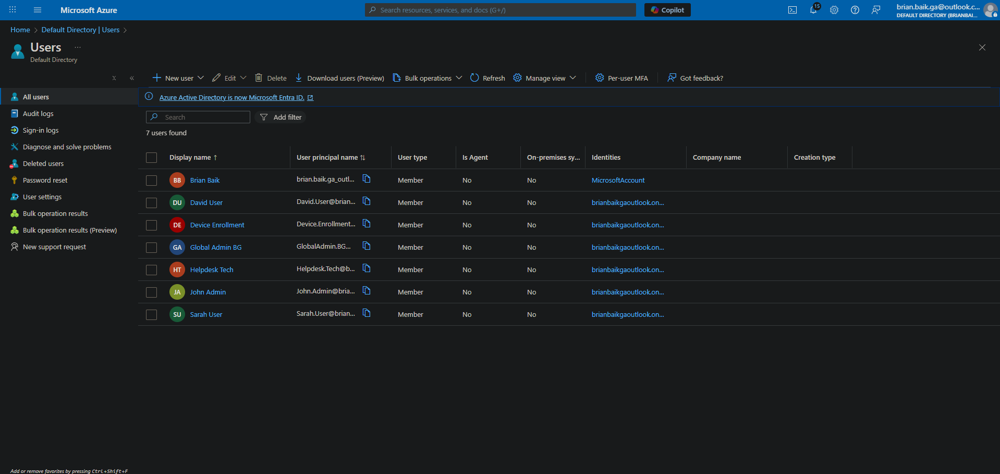
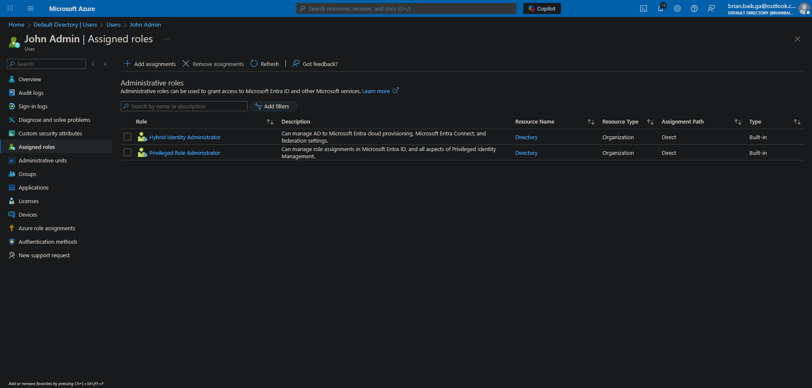
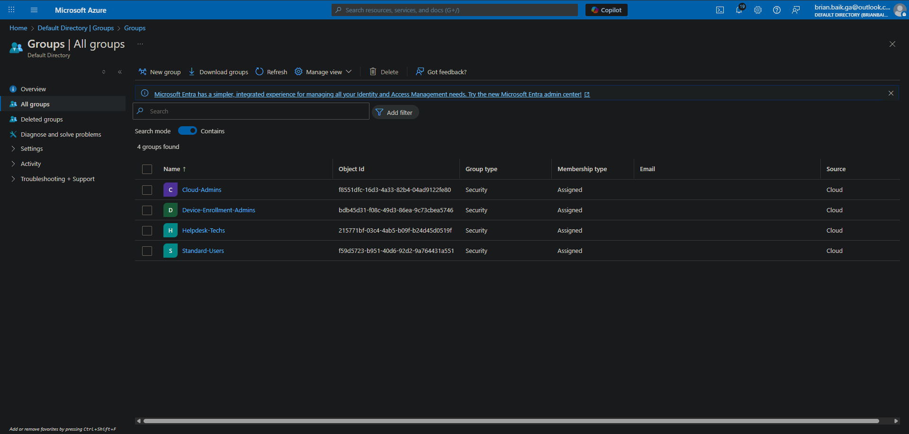
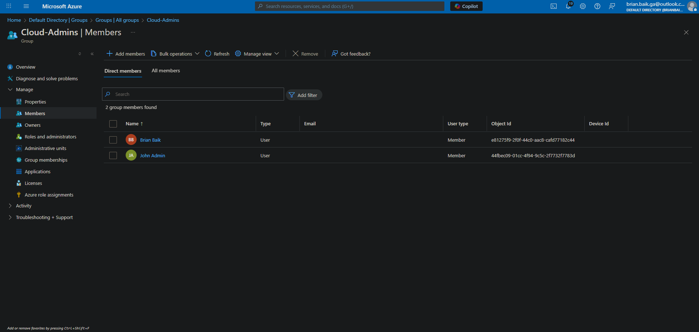

# Lab 9: Entra ID Cloud Users, Roles, and Groups

## Overview
This lab creates the initial cloud identity structure for the tenant. I added cloud-only users, assigned directory roles, and organized accounts into security groups. This prepares the environment for MFA, Intune device management, Autopilot enrollment, Conditional Access, and hybrid identity.

---

## Tasks Completed

### 1. Created cloud-only users
I created the following accounts in Microsoft Entra ID:

- Brian Baik (Global Admin, Security Administrator)
- BG Admin (Global Administrator, break glass account)
- John Admin (Privileged Role Administrator, Hybrid Identity Administrator)
- Helpdesk Tech
- David User
- Sarah User
- Device Enrollment

This forms a small but realistic identity layout that separates admin, helpdesk, and standard user roles.

#### Screenshot 01: Entra Users List  
Shows all cloud-only users created for this lab.  
**File:** `01-entra-users-list.png`

---

### 2. Assigned directory roles
Roles were assigned to match realistic governance while still allowing full administrative functionality for homelab tasks.

| User | Role |
|------|------|
| Brian Baik | Global Administrator, Security Administrator |
| BG Admin | Global Administrator (break glass account) |
| John Admin | Privileged Role Administrator, Hybrid Identity Administrator |
| Helpdesk Tech | Helpdesk Administrator |
| Device Enrollment | No role needed yet |
| David and Sarah | Standard users |

A dedicated break glass admin is included to follow proper privileged identity practices.

#### Screenshot 02: Brian Baik Assigned Roles  
Shows Global Administrator and Security Administrator assignments.  
**File:** `02-entra-user-details-brian.png`

#### Screenshot 03: John Admin Assigned Roles  
Shows Privileged Role Administrator and Hybrid Identity Administrator assignments.  
**File:** `03-entra-john-assigned-roles.png`

---

### 3. Created core security groups
These groups will be used later for Intune enrollment, Conditional Access, Autopilot, MFA enforcement, and device-based policy targeting.

- **Cloud-Admins**  
  Members: Brian Baik, John Admin  
  Description: High privilege administrators for cloud services.

- **Helpdesk-Techs**  
  Members: Helpdesk Tech  
  Description: Delegated permissions for support and troubleshooting tasks.

- **Standard-Users**  
  Members: David User, Sarah User  
  Description: Regular non-admin accounts for policy testing and enrollment scenarios.

- **Device-Enrollment-Admins**  
  Members: Device Enrollment  
  Description: Used for Intune and Windows Autopilot device enrollment.

#### Screenshot 04: Entra Groups List  
Shows all identity groups created for this lab.  
**File:** `04-entra-groups-list.png`

#### Screenshot 05: Cloud-Admins Group Membership  
Shows Brian and John in the Cloud-Admins group.  
**File:** `05-entra-group-members-cloud-admins.png`

---

## Why This Lab Matters

This lab establishes the identity framework that the rest of the cloud and hybrid environment will rely on. Entra ID controls authentication and authorization for Intune, Autopilot, Conditional Access, and hybrid identity. A structured identity layer ensures that policies can be targeted safely and administrative boundaries remain secure.

### Cloud-only users
Cloud-only accounts let me test identity behavior before introducing directory synchronization. This matches how organizations stage their cloud environment before deploying hybrid join or Entra Connect.

### Directory role assignments
Even though I use Global Administrator rights for lab setup, the design includes role separation. Delegating Privileged Role Administrator, Hybrid Identity Administrator, and Helpdesk Administrator to specific accounts follows realistic identity governance and avoids relying solely on a single high privilege identity.

### Security groups
Groups provide the targeting layer for device and access policies. These groups will be used for Conditional Access enforcement, MFA rollout, Intune configuration, and Autopilot assignments. Separating identities into Cloud-Admins, Helpdesk-Techs, Standard-Users, and Device-Enrollment-Admins keeps the tenant structured and aligned with real enterprise practice.

This lab provides the identity blueprint that all future cloud and hybrid configurations will build upon.

---

## Next Lab
With cloud identity in place, the next step is securing the tenant and preparing it for device management.

**Next Lab:**  
**Lab 10 – MFA and Security Defaults Setup**
